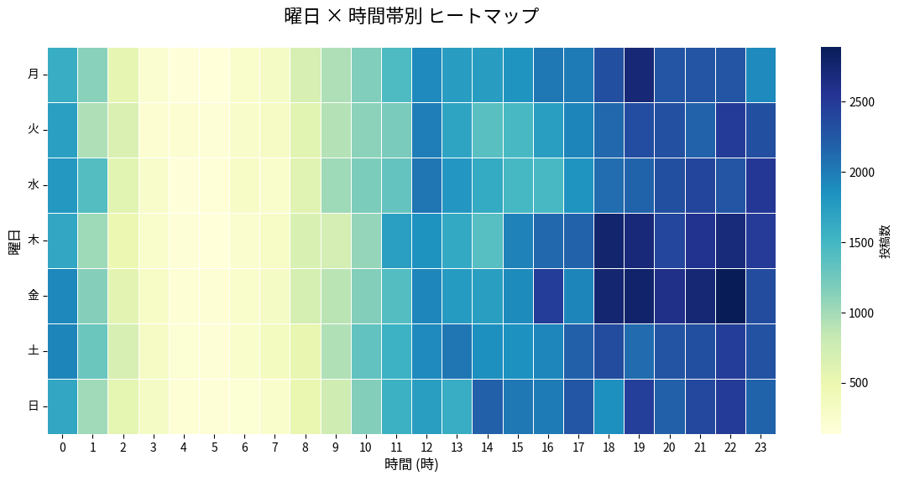

こんにちは。[KMC Advent Calendar 2025](https://adventar.org/calendars/12258)の14日目の記事です。
昨日はあきのおいもさんの[ipadのお絵描きファイルを安全に管理する](https://autamnpoteto.hateblo.jp/entry/2026/01/18/215439) です。
明日はiromさんの [C107に『独習KMC vol.23』を販売します](https://blog.kmc.gr.jp/entry/2025/12/15/120000) です。今回、[やらわ](https://yarawa.hatenablog.com/entry/2025/12/23/153410?_gl=1*15qdk5m*_gcl_au*Mjg4NzE4MzY5LjE3NjU1MjA0NTc.)さんが部誌の表紙を担当されています。**ぜひお買い求めください。**

# Slackのログを振り返る
KMCのSlack上にあるpublic channelの中には大まかに分けて、#active といった全体で情報を共有するもの、#2025-機械学習勉強会 といった活動で情報交換をするためのもの、#akkey-memo といった個人がつぶやくためのもの、#everything といった全public channel上の発言を表示するために自動化されたもの(Twitterのタイムライン-like)、などがあります。また用途が限られた不思議なチャンネルが時折建てられそしてアーカイブされてゆきます。

<div align="center">


*:crying_laughing_poyon: 最近Slack内で流行した*

</div>

最近私に付与されたroot権限を用いてSlackのアナリティクスを見ると、メンバー数は927人、12月のアクティブユーザーは246人で、メッセージは258,965件送信されています。あまりにも多いので、部員の**時間帯別のメッセージ数**が気になります。

# 分析

期間は2025年4月1日から2025年12月17日までとします。API経由でデータをダウンロードすることも可能ですが、Slackからログのデータをjson形式でエクスポートすることで気軽に解析することが可能になりました。Pythonで保存したディレクトリにアクセスし、bot以外のメッセージを時間帯別に可視化します。
```python
def is_bot_message(msg):
    if msg.get("subtype") == "bot_message": return True
    if "bot_id" in msg: return True
    if msg.get("user") == "USLACKBOT": return True
    return False
```
このようにしてbotを弾きます。
# 分析結果

- 金曜日の夜にもっともメッセージが増え
- 火曜日、水曜日、木曜日の昼過ぎに減る

1つ目の理由は金曜日の夜は次の日授業が無いため多くの人がSlackに浮上してくるから、また２つ目の理由は3~5限に授業が入っている部員が多いからだと考えられます。KMCでは授業期間中の毎週月曜日と木曜日に19時から例会を開いているため、この時間にメッセージが増えることも確認できます。
# あとがき


KMC49代の[**monta**](https://x.com/monta3135)がこの記事を書きました。
私は大阪のある大学に属しており家も遠いため、主にSlack上で部員と交流を図っています。最近興味がある分野はネットワークです。上回生にはネットワークの研究室に属されている方がいらっしゃるので、**ばしばし**交流を深めたいです。